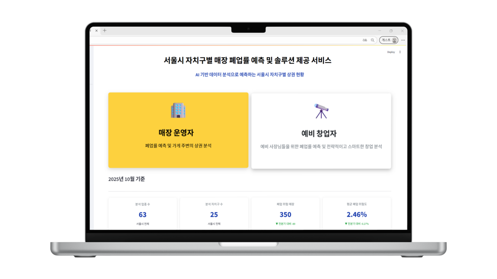

# SKN 19기 2차 프로젝트 1팀
<br><br>

## 🏪 서울시 자치구별 매장 폐업률 예측
서울시 매장 운영자와 예비 창업자를 위한 폐업률 예측 및 솔루션 제시

# 팀 소개
## 🍻 팀명

B+(Business Planner)

## 👥 팀원 소개 및 역할
<table>
  <thead>
    <tr style="text-align:center;">
      <th align="center"><a href="https://github.com/jongminkim-KR1">👑 김종민</a></th>
      <th align="center"><a href="https://github.com/vispi94">박진형</a></th>
      <th align="center"><a href="https://github.com/ahnsui">안수이</a></th>
      <th align="center"><a href="https://github.com/ChocolateStrawberryYumYum">이상민</a></th>
      <th align="center"><a href="https://github.com/HyojungJ">장효정</a></th>
    </tr>
  <tr>
    <td align="center">
      <br><br>
      DL (TabNet)<br>/ Streamlit
    </td>
    <td align="center">
      <br><br>
      ML (LightGBM)<br>/ Streamlit
    </td>
    <td align="center">
      <br><br>
      ML (XGBoost)<br>/ Streamlit
    </td>
    <td align="center">
      <br><br>
      ML (RandomForest)<br>/ Streamlit
    </td>
    <td align="center">
      <br><br>
      ML (CatBoost)<br>/ Readme & 발표
    </td>
  </tr>
</table>

# 프로젝트 개요

## 🗓️ 개발 기간
2025.09.30 ~ 2025.10.15

## 📢 프로젝트 소개

### 주요 내용

- 서울시 자치구 및 업종별 폐업률 데이터 수집 및 분석

- 머신러닝과 딥러닝을 활용한 예측 모델 개발

- 사용자 맞춤형 폐업률 예측 및 시각화 제공

- Streamlit을 통한 웹 기반 대시보드 구현

### 대상 사용자

- 예비 창업자: 입지 선정 전, 폐업 위험도를 확인하고 전략적으로 창업 가능

- 기존 매장 운영자: 내 매장의 위험 수준을 진단하고, 경쟁력 강화 방안 탐색

- 정책 담당자 및 컨설턴트: 지역 상권 활성화를 위한 기초 자료로 활용 가능

## 📖 프로젝트 배경


###### 출처 : [아시아경제](https://news.zum.com/articles/91079942/%EC%84%9C%EC%9A%B8%EC%84%9C-5%EB%AA%85-%EC%A4%91-1%EB%AA%85-%EB%A7%9D%ED%95%B4-%EA%B0%95%EB%82%A8%EA%B5%AC-%ED%8F%90%EC%97%85-%EB%A7%A4%EC%9E%A5-%EC%B5%9C%EB%8B%A4-%EC%9C%84%EA%B8%B0%EC%9D%98-%EC%9E%90%EC%98%81%EC%97%85%EC%9E%90?utm_source=chatgpt.com), [관련 논문](https://koreascience.kr/journal/GJOHB6/v38n3.do?utm_source=chatgpt.com)

## 🎯 프로젝트 목표
1. 서울시 자치구별 매장 폐업률 데이터를 수집 및 분석

    - 공공데이터를 활용하여 상권·인구·매장 정보 등 다양한 지표 수집

    - 지역별 상권 특성과 폐업률 간의 상관관계 분석

2. 머신러닝 및 딥러닝 기반 예측 모델 개발

    - 지도학습 기법을 적용해 폐업률 예측 모델 구축

    - CatBoost, XGBoost, Random Forest 등 머신러닝 알고리즘 비교

    - 딥러닝 모델(TabNet)을 통한 성능 향상 시도 및 비교 평가

3. 사용자 친화적인 예측 시스템 구현 (Streamlit)

    - 사용자가 자치구, 업종, 임대료 등을 입력하면 폐업률 예측

    - 시각화를 통해 인사이트 제공

    - 예비 창업자에게 입지 선정 및 리스크 회피 전략 제안

## 📂 프로젝트 디렉토리 구조
```python
Project
│
├─ data
│   ├─ raw                    # rawdata        
│   └─ processed              # 전처리 완료한 data
├─ eda
│   ├─ code                   # EDA 및 merge 코드        
│   └─ data                   # 정제한 데이터셋       
│
├─ model                      # 모델 학습 및 시각화 코드
│   ├─ catboost
│   ├─ dl 
│   ├─ lightgbm        
│   ├─ randomforest          
│   └─ xgboost
│
└─streamlit                   # Streamlit 구현 코드
    ├─ pages         
    └─ app.py
```

# 기술 스택

<table>
  <thead>
    <tr>
      <th style="text-align:center;">분류</th>
      <th style="text-align:center;">기술</th>
    </tr>
  </thead>
  <tbody>
    <tr>
      <td align="center">협업 및 형상 관리</td>
      <td>
        
        
      </td>
    </tr>
    <tr>
      <td align="center">개발 환경 & 언어</td>
      <td>
        
        
      </td>
    </tr>
    <tr>
      <td align="center">데이터 분석</td>
      <td>
        
        
        
      </td>
    </tr>
    <tr>
      <td align="center">데이터 시각화</td>
      <td>
        
        
      </td>
    </tr>
    <tr>
      <td align="center">머신 러닝 & 딥러닝</td>
      <td>
        
        
        
        
        
        
      </td>
    </tr>
    <tr>
      <td align="center">대시보드</td>
      <td>
        
      </td>
    </tr>
  </tbody>
</table>

# WBS


### ✔️ 데이터셋 소개

서울시 상권분석 서비스에서 제공하는 데이터로 서울시 자치구별 데이터를 제공

##### 출처 : [점포-자치구](https://data.seoul.go.kr/dataList/OA-22173/S/1/datasetView.do), [상권변화지표-자치구](https://data.seoul.go.kr/dataList/OA-15567/S/1/datasetView.do), [추정매출-자치구](https://data.seoul.go.kr/dataList/OA-22176/S/1/datasetView.do), [상주인구-자치구)](https://data.seoul.go.kr/dataList/OA-22182/S/1/datasetView.do), [길단위인구-자치구](https://data.seoul.go.kr/dataList/OA-22179/S/1/datasetView.do), [직장인구-자치구](https://data.seoul.go.kr/dataList/OA-22185/S/1/datasetView.do), [소득소비-자치구)](https://data.seoul.go.kr/dataList/OA-22167/S/1/datasetView.do), [지역별 임대시세](https://golmok.seoul.go.kr/stateArea.do)

# 데이터 전처리 결과서(EDA)
### 데이터 구조 확인
- 주요 컬럼 : 기준년분기코드,  자치구코드명, 서비스업종코드명, 점포수,  총유동인구수, 개업률, 폐업률 등 
- 총 특성 수 : 133개
- Target : 폐업률

### 데이터 시각화
- Heatmap(폐업률 기준 상위 10개)

<p align="center">
  
</p>

- 폐업률 분포

<p align="center">
  
</p>

- 폐업률 상위 15개 업종

<p align="center">
  
</p>

- 당월 매출 금액 대비 폐업률 
    - 당월 매출액이 낮을수록 폐업 가능성 증가

<p align="center">
  
</p>
   
- 폐업 여부별 프랜차이즈 점포 비율(폐업률 상위 25% 기준 분류) 분포 
    - 위험 그룹(1)은 전체 데이터의 25%에 불과하지만 프랜차이즈 점포 수가 상대적으로 높음
    - 프랜차이즈 점포 수가 많을수록 폐업률이 증가하는 경향 확인

<p align="center">
  
</p>

### 데이터 전처리
- Drop
    - 폐업 점포 수 : 정답(Target)인 폐업률과 중복 → 누설 방지를 위해 제외
    - 폐업 영업 개월 평균, 서울시 폐업 영업 개월 평균 : 이미 폐업한 점포의 정보 → 사전 예측에 부적절
    - 기준 년분기 코드 : 자치구 기준 분석에서 의미 없는 변수로 판단 → 제거

- Encoding
    - 범주형 변수('자치구_코드_명', '서비스_업종_코드_명', '상권_변화_지표')에 Label Encoding 적용
    - 고유값이 많아 One-Hot Encoding 대신 사용, 트리 기반 모델과의 적합성 고려

### 피처 엔지니어링
- 전체 데이터의 상위 25%(폐업률 : 3.6)를 기준으로 폐업률 등급을 분류하여 데이터 불균형 발생 (생존(0) : 30153 / 폐업(1) : 9822)
- SMOTE 기법을 활용해 소수 클래스 데이터를 증강하여 불균형 문제 완화

### 데이터 분할
- 전체 데이터를 학습 80% / 평가 20%로 분할
- 학습 데이터 내에서 학습 90% / 검증 10%로 추가 분할하여 모델 튜닝 수행

# 인공지능 학습 결과서
## Machine Learning
### 모델 비교 개요
- 폐업률 예측을 위한 이진 분류 기반 머신러닝 모델 개발

- 사용 모델: 
    - RandomForest
    - LightGBM
    - XGBoost
    - CatBoost 

- 공통 설정:
    - 폐업률 상위 25% 기준 이진 분류
    - Optuna 기반 하이퍼파라미터 튜닝
    - Stratified K-Fold 교차 검증 적용

### 모델별 성능 결과 비교
- 하이퍼파라미터 튜닝 전
  <table>
    <tr>
      <th>Model</th>
      <th>Accuracy</th>
      <th>Precision</th>
      <th>Recall</th>
      <th>F1 Score</th>
      <th>AUC</th>
    </tr>
    <tr>
      <td>RandomForest</td>
      <td>0.7948 (79.48%)</td>
      <td>0.7919 (79.19%)</td>
      <td>0.7999 (79.99%)</td>
      <td>0.7958</td>
      <td>0.8681</td>
    </tr>
    <tr>
      <td>LightGBM</td>
      <td>0.7939 (79.39%)</td>
      <td>0.5712 (57.12%)</td>
      <td>0.6456 (64.56%)</td>
      <td>0.6061</td>
      <td>0.8313</td>
    </tr>
    <tr style="background-color:#DFF0D8;">
      <td><strong>CatBoost</strong></td>
      <td><strong>0.8650 (86.50%)</strong></td>
      <td><strong>0.8752 (87.52%)</strong></td>
      <td><strong>0.8514 (85.14%)</strong></td>
      <td><strong>0.8632</strong></td>
      <td><strong>0.9387</strong></td>
    </tr>
    <tr>
      <td>XGBoost</td>
      <td>0.8557 (85.57%)</td>
      <td>0.8577 (85.77%)</td>
      <td>0.8529 (85.29%)</td>
      <td>0.8553</td>
      <td>0.9300</td>
    </tr>
  </table>

- 하이퍼파라미터 튜닝 후
  <table>
    <tr>
      <th>Model</th>
      <th>Accuracy</th>
      <th>Precision</th>
      <th>Recall</th>
      <th>F1 Score</th>
      <th>AUC</th>
    </tr>
    <tr>
      <td>RandomForest</td>
      <td>0.8252 (82.52%)</td>
      <td>0.8131 (81.31%)</td>
      <td>0.8445 (84.45%)</td>
      <td>0.8285</td>
      <td>0.8255</td>
    </tr>
    <tr>
      <td>LightGBM</td>
      <td>0.8044 (80.44%)</td>
      <td>0.6022 (60.22%)</td>
      <td>0.6931 (69.31%)</td>
      <td>0.6445</td>
      <td>0.8605</td>
    </tr>
    <tr style="background-color:#DFF0D8;">
      <td><strong>CatBoost</strong></td>
      <td><strong>0.8802 (88.02%)</strong></td>
      <td><strong>0.8920 (89.20%)</strong></td>
      <td><strong>0.8652 (86.52%)</strong></td>
      <td><strong>0.8784</strong></td>
      <td><strong>0.9500</strong></td>
    </tr>
    <tr>
      <td>XGBoost</td>
      <td>0.8788 (87.88%)</td>
      <td>0.8864 (88.64%)</td>
      <td>0.8690 (86.90%)</td>
      <td>0.8776</td>
      <td>0.9500</td>
    </tr>
  </table>

✅ 결론 : CatBoost가 가장 높은 성능을 보여 최적의 모델로 선정

### CatBoost 모델 학습 결과
1. Confusion Matrix
<p align="center">
  
</p>

2. ROC Curve
<p align="center">
  
</p>

3. Precision-Recall Curve
<p align="center">
  
</p>

4. Feature Importance (Top 30)
<p align="center">
  
</p>

## Deep Learning
### TabNet 모델 개요
- 폐업률 데이터에 뚜렷한 시간적 추세가 없어, 시계열 모델(RNN) 대신 표형 데이터에 적합한 TabNet 모델 적용
- Optuna 기반 하이퍼파라미터 튜닝

- TabNet Architecture
<p align="center">
  
</p>

- Machine Learning vs Tabnet
<table border="1" cellspacing="0" cellpadding="8" style="border-collapse: collapse; width: 100%; text-align: center;">
  <thead>
    <tr style="background-color: #f2f2f2;">
      <th style="width: 18%;">구분</th>
      <th>🌳 트리 기반 모델 (XGBoost, LightGBM 등)</th>
      <th>🤖 TabNet</th>
    </tr>
  </thead>
  <tbody>
    <tr>
      <td><strong>핵심 원리</strong></td>
      <td> - 데이터를 잘 나누는 최적의 질문(경계)을 찾아 나무 구조로 학습</td>
      <td> - 순차적 어텐션으로 중요한 Feature에 집중하며 단계적으로 학습 (딥러닝)</td>
    </tr>
    <tr>
      <td><strong>학습 방식</strong></td>
      <td> - 미리 정해진 규칙(정보 이득 등)에 따라 데이터를 분할</td>
      <td> - 경사 하강법(Gradient Descent)을 통해 전체 네트워크를 한 번에 최적화 (End-to-End Learning)</td>
    </tr>
    <tr>
      <td><strong>Feature 처리</strong></td>
      <td> - 개별 Feature를 독립적으로 처리하는 경향이 있음</td>
      <td> - 여러 Feature를 동시에 고려하고 복잡한 조합을 스스로 학습</td>
    </tr>
    <tr>
      <td><strong>강점</strong></td>
      <td>
        - 학습 속도가 빠르고 일반적으로 높은 성능을 보임<br>
        - 모델의 작동 방식을 이해하기 비교적 쉬움
      </td>
      <td>
        - 피처 엔지니어링 부담이 적음<br>
        - 스트리밍 데이터처럼 계속 들어오는 데이터 학습에 유리<br>
        - 복잡하고 미묘한 패턴 발견에 강함
      </td>
    </tr>
    <tr>
      <td><strong>단점</strong></td>
      <td>
        - 새로운 데이터 패턴에 대한 일반화 성능이 딥러닝보다 떨어질 수 있음<br>
        - 피처 엔지니어링이 중요함
      </td>
      <td>
        - 트리 모델보다 학습 시간이 더 오래 걸릴 수 있음<br>
        - 대규모 데이터셋에서 더 좋은 성능을 보이는 경향이 있음
      </td>
    </tr>
  </tbody>
</table>

### TabNet 모델 성능 결과
<table>
    <tr>
      <th>Model</th>
      <th>Accuracy</th>
      <th>Precision</th>
      <th>Recall</th>
      <th>F1 Score</th>
      <th>AUC</th>
    </tr>
    <tr>
      <td>하이퍼파라미터 튜닝 전</td>
      <td>0.7408 (74.08%)</td>
      <td>0.7171 (71.71%)</td>
      <td>0.8095 (80.95%)</td>
      <td>0.7605</td>
      <td>0.8285</td>
    </tr>
    <tr>
      <td>하이퍼파라미터 튜닝 후</td>
      <td>0.8309 (83.09%)</td>
      <td>0.8324 (83.24%)</td>
      <td>0.8286 (82.86%)</td>
      <td>0.8305</td>
      <td>0.9144</td>
    </tr>
  </table>


### Tab 모델 학습 결과
1. Confusion Matrix
<p align="center">
  
</p>

2. ROC Curve
<p align="center">
  
</p>

3. Feature Improtance (Top 30)
<p align="center">
  
</p>

# 수행 결과
##  Streamlit 

- 홈
<p align="center">
  
</p>

- 정보 입력
<p align="center">
  
</p>

- 분석 결과
<p align="center">
  
</p>

- 상세 비교 분석
<p align="center">
  
</p>

- 사용자 맞춤 솔루션
<p align="center">
  
</p>

## 🧭 기대효과 및 활용방안
**기대효과**
- **소상공인 리스크 감소**
    
    데이터 기반 예측을 통한 상권 위험 지역 사전 파악을 통해 예비 창업자 및 점주의 리스크 감소
    
- **지역 경제 활성화**
    
    자치구별 상권 분석 결과를 활용한 정책 지원 방향을 제시하여 매장 폐업률 감소 및 지역 경제 활성화
    
- **맞춤형 소상공인 지원 강화**
    
    업종 및 지역별 폐업 위험도 분석을 통한 정책 자원 효율적 배분과 맞춤형 컨설팅 제공
    

**활용방안**

- **예비 창업자 지원 도구**
    
    업종 및 지역별 폐업 위험도 확인을 통한 입지 선정 및 리스크 관리
    
    저비용의 효율적 의사결정 지원 도구 활용
    
- **상권 정책 및 행정 활용**
    
    폐업률 예측 데이터를 활용한 소상공인 지원정책 수립 및 상권 활성화 전략 마련
    
- **컨설팅 및 교육 자료 활용**
    
    공공데이터 기반 AI 분석 사례를 활용한 창업 컨설팅 및 교육 자료 제공

# 회고

## 🛠️ 트러블 슈팅

1. 특성 컬럼 부족 문제

    - 초기 데이터셋(점포-자치구 기준)만으로는 예측에 필요한 변수가 부족하여 모델 학습에 한계가 있었음

    - 이를 해결하기 위해 특정 업종 중심으로 프로젝트 범위를 좁히는 방안 검토

    - 이후 추가 데이터 수집을 통해 특성 컬럼을 확충하며 문제 해소

2. 회귀 모델 성능 저하

    - 초기에는 폐업률 예측을 위한 회귀 모델을 적용했으나, 머신러닝 및 딥러닝 모델 모두 낮은 성능(r² < 0.5)을 보임

    - 이에 따라 일정 기준 폐업률 이상을 ‘폐업’으로 정의하고, 이진분류 모델로 전환하여 성능을 개선

3. 시계열 모델 부적합

    - 분기별 데이터를 활용해 시계열 모델(RNN)을 시도했으나, 폐업률의 시간적 추세가 미미하여 학습 효과가 낮았음

    - 결국 시간 변수를 제외하고, 자치구 및 업종 특성 기반의 TabNet 분류 모델로 전환하여 문제 해결

자세한 문제 해결 방법은 [TROUBLE_SHOOTING.md](./TROUBLE_SHOOTING.md) 문서를 참고하세요.

## 💭 한 줄 회고

- **김종민**

  최근 몇 년간 이어진 높은 폐업률 문제 해결의 뒷받침이 되고자 본 프로젝트를 시작했다.
초기 시계열 데이터에 장점을 갖는 RNN 계열 모델을 검토했으나, 데이터 분석 결과 시계열적 특성이 뚜렷하지 않아 Tabular 데이터에 최적화된 TabNet 모델을 선정하였습니다. 또한 Streamlit 기반의 User-Friendly한 대시보드를 구축하여 실질적인 인사이트를 제공하고자 했습니다.
향후 거시 경제 지표 등 시계열 특성을 활용해 현재 사회의 흐름을 반영할 수 있는 고도화된 예측 모델로 발전시키고자 합니다.

- **박진형**
  
  LightGBM의 예측 성능을 안정화하고 Streamlit으로 실제 서비스 페이지를 완성하기까지, 많은 시행착오가 있었습니다.
  데이터 전처리부터 시각화, 모델 학습 및 평가까지 팀원 모두 같이 시행해보며 함께 처음부터 끝까지 했다 라는게 가장 큰 자산이라고 생각합니다.
  서로 의견을 나누며 부족한걸 보완하고 리드미와 시연까지 만족할 수 있어 뜻깊은 경험이었습니다.
  
- **안수이**
  
  미니프로젝트를 한번 진행하고 2차 프로젝트를 하니 EDA나 모델 학습 과정에서의 협업이 더 수월했던 것 같습니다. XGBoost로 모델을 학습시키면서 Optuna를 활용한 하이퍼파라미터 최적화, SMOTE를 통한 데이터 불균형 처리 등을 적용하여 성능을 개선해보는 경험을 할 수 있었습니다. 여러 번의 회의와 실험을 통해 팀원들과 아이디어를 공유하며 예상치 못한 문제들을 함께 해결하는 경험이 의미있었습니다.
  
- **이상민**

  미니 프로젝트 때와 마찬가지로,  이번 2차 프로젝트에는 데이터 분석, 머신러닝부터 모델 검증 및 평가까지 1차 프로젝트 이후 배운 내용들을 모두 써봐서 프로젝트를 진행하는 동안 복습 효과도 컸던 것 같습니다. 팀원들끼리 여러 모델들을 각자 맡아서 진행했었는데, 제가 진행한 randomforest 모델이 다른 분들의 모델에 비해 결과가 약간 좋지 않은 편이어서 조금 아쉽긴 했습니다. 이번 2차 프로젝트는 미니 프로젝트랑 비슷한 과정이기는 했지만, 그때보다는 전처리나 ml 과정이 훨씬 수월하게 진행되었고 당시에는 안 써봤던 합성소수 샘플링 기법이나 optuna 하이퍼파라미터 튜닝도 사용해보아서 색다르게 느껴졌습니다. 개인적으로 최종 결과물이 정말 잘 나왔다고 느꼈는데, 연휴가 끼어있음에도 불구하고 팀원들끼리 활발하게 소통하면서 분업을 진행한 덕분이라고 생각합니다.

- **장효정**

  이번 프로젝트에서 EDA, 머신러닝 등 이전에 학습했던 내용들을 모두 활용할 수 있었습니다. 학습용 데이터가 아닌 실제 데이터로 프로젝트를 진행하여 직접 데이터 전처리를 해 볼 수 있어 미래 실무에 많은 도움이 될 수 있는 경험이었다고 생각합니다. 또한 수업 시간에 많이 다루지 않았던 CatBoost 모델을 담당하게 되어 복습과 새로운 학습을 병행할 수 있어 뜻깊었습니다. 프로젝트 진행 중 모델 성능이 향상되지 않는 문제가 있었지만 특성 공학과 하이퍼파라미터 튜닝을 활용하여 성능을 향상시킬 수 있었습니다. 가장 인상 깊었던 점은 이번 프로젝트에서 GitHub를 통해 팀원들과 원활하게 소통할 수 있었다는 점이고 이를 통해 GitHub 활용 방법과 협업 경험을 얻을 수 있어 많은 도움이 될 프로젝트였습니다.
