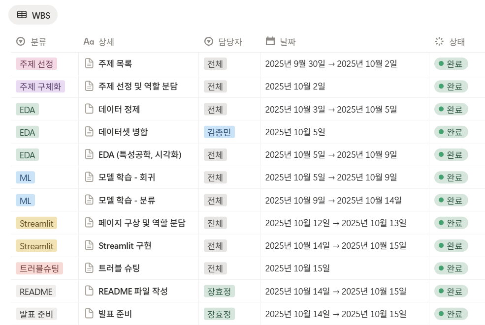

# SKN 19기 2차 프로젝트 1팀
## 🏪 서울시 자치구별 매장 폐업률 예측
서울시 매장 운영자와 예비 창업자를 위한 폐업률 예측 및 솔루션 제시

# 팀 소개
## 🍻 팀명

오오오

## 👥 팀원 소개 및 역할
<table>
  <thead>
    <tr style="text-align:center;">
      <th align="center"><a href="https://github.com/jongminkim-KR1">👑 김종민</a></th>
      <th align="center"><a href="https://github.com/vispi94">박진형</a></th>
      <th align="center"><a href="https://github.com/ahnsui">안수이</a></th>
      <th align="center"><a href="https://github.com/ChocolateStrawberryYumYum">이상민</a></th>
      <th align="center"><a href="https://github.com/HyojungJ">장효정</a></th>
    </tr>
  <tr>
    <td align="center">
      <br><br>
      DL (TabNet)<br>/ Streamlit
    </td>
    <td align="center">
      <br><br>
      ML (LightGBM)<br>/ Streamlit
    </td>
    <td align="center">
      <br><br>
      ML (XGBoost)<br>/ Streamlit
    </td>
    <td align="center">
      <br><br>
      ML (RandomForest)<br>/ Streamlit
    </td>
    <td align="center">
      <br><br>
      ML (CatBoost)<br>/ Readme & 발표
    </td>
  </tr>
</table>

# 프로젝트 개요

## 🗓️ 개발 기간
2025.10.14 ~ 2025.10.15

## 📢 프로젝트 소개
본 프로젝트는 서울시의 실제 상권 데이터를 기반으로 자치구별 매장 폐업률을 예측하고, 예비 창업자 및 기존 매장 운영자에게 데이터 기반의 인사이트와 솔루션을 제공합니다.

최근 경기 침체 및 상권 변화로 인해 소상공인의 폐업 위험이 증가하고 있는 가운데, 본 프로젝트는 머신러닝 및 딥러닝 기법을 활용하여 폐업 위험을 사전에 예측하고, Streamlit 기반 대시보드를 통해 누구나 쉽게 접근할 수 있는 의사결정 지원 도구를 구축하는 것을 목표로 합니다.

### 주요 내용

- 서울시 자치구 및 업종별 폐업률 데이터 수집 및 분석

- 머신러닝과 딥러닝을 활용한 예측 모델 개발

- 사용자 맞춤형 폐업률 예측 및 시각화 제공

- Streamlit을 통한 웹 기반 대시보드 구현

### 대상 사용자

- 예비 창업자: 입지 선정 전, 폐업 위험도를 확인하고 전략적으로 창업 가능

- 기존 매장 운영자: 내 매장의 위험 수준을 진단하고, 경쟁력 강화 방안 탐색

- 정책 담당자 및 컨설턴트: 지역 상권 활성화를 위한 기초 자료로 활용 가능

## 📖 프로젝트 배경


서울시는 외식업, 프랜차이즈, 커피전문점 등 다양한 업종에서 폐업률이 점차 증가하고 있으며, 특히 최근 데이터에 따르면 외식업 폐업률은 약 18.99% 수준으로, 2024년 기준 전년 대비 큰 폭으로 상승했습니다.  

또한 코로나19 팬데믹으로 인해 상권 활력(매출, 유동인구 등)이 급감하였으며, 현재까지 그 여파가 이어지고 있습니다. 매장 업종별/행정동별로 그 충격의 강도와 회복 속도가 다름이 여러 연구로 확인되었습니다. 

이러한 변화는 자치구별 상권 특성과 외부 요인의 상호작용으로 인해 발생하였다고 볼 수 있으며 단순한 통계 수치만으로는 폐업 위험을 예측하는 데 한계가 있음을 확인할 수 있습니다.

따라서 이번 프로젝트를 통해 서울시 자치구 및 업종별 데이터를 임대료, 매출, 유동 인구 등 외부적 요인 데이터와 함께 분석하여 자치구별 폐업률을 예측하고 그에 따른 솔루션을 제공하고자 합니다.

###### 출처 : [아시아경제](https://news.zum.com/articles/91079942/%EC%84%9C%EC%9A%B8%EC%84%9C-5%EB%AA%85-%EC%A4%91-1%EB%AA%85-%EB%A7%9D%ED%95%B4-%EA%B0%95%EB%82%A8%EA%B5%AC-%ED%8F%90%EC%97%85-%EB%A7%A4%EC%9E%A5-%EC%B5%9C%EB%8B%A4-%EC%9C%84%EA%B8%B0%EC%9D%98-%EC%9E%90%EC%98%81%EC%97%85%EC%9E%90?utm_source=chatgpt.com), [관련 논문](https://koreascience.kr/journal/GJOHB6/v38n3.do?utm_source=chatgpt.com)

## 🎯 프로젝트 목표
1. 서울시 자치구별 매장 폐업률 데이터를 수집 및 분석

    - 공공데이터를 활용하여 상권·인구·매장 정보 등 다양한 지표 수집

    - 지역별 상권 특성과 폐업률 간의 상관관계 분석

2. 머신러닝 및 딥러닝 기반 예측 모델 개발

    - 지도학습 기법을 적용해 폐업률 예측 모델 구축

    - CatBoost, XGBoost, Random Forest 등 머신러닝 알고리즘 비교

    - 딥러닝 모델(TabNet)을 통한 성능 향상 시도 및 비교 평가

3. 사용자 친화적인 예측 시스템 구현 (Streamlit)

    - 사용자가 자치구, 업종, 입대료 등을 입력하면 폐업률 예측

    - 시각화를 통해 인사이트 제공

    - 예비 창업자에게 입지 선정 및 리스크 회피 전략 제안

## 📂 프로젝트 디렉토리 구조
```python
Project
│
├─ data
│   ├─ raw                    # rawdata        
│   └─ processed              # 전처리 완료한 data
├─ eda
│   ├─ code                   # EDA 및 merge 코드        
│   └─ data                   # 정제한 데이터셋       
│
├─ model                      # 모델 학습 및 시각화 코드
│   ├─ catboost
│   ├─ dl 
│   ├─ lightgbm        
│   ├─ randomforest          
│   └─ xgboost
│
└─streamlit                   # Streamlit 구현 코드
    ├─ pages         
    └─ app.py
```

# 기술 스택

<table>
  <thead>
    <tr>
      <th style="text-align:center;">분류</th>
      <th style="text-align:center;">기술</th>
    </tr>
  </thead>
  <tbody>
    <tr>
      <td align="center">협업 및 형상 관리</td>
      <td align="center">
        
        
      </td>
    </tr>
    <tr>
      <td align="center">개발 환경 & 언어</td>
      <td align="center">
        
        
      </td>
    </tr>
    <tr>
      <td align="center">데이터 분석</td>
      <td align="center">
        
        
        
      </td>
    </tr>
    <tr>
      <td align="center">데이터 시각화</td>
      <td align="center">
        
        
      </td>
    </tr>
    <tr>
      <td align="center">머신 러닝 & 딥러닝</td>
      <td align="center">
        
        
        
        
        
        
      </td>
    </tr>
    <tr>
      <td align="center">대시보드</td>
      <td align="center">
        
      </td>
    </tr>
  </tbody>
</table>

# WBS


### ✔️ 데이터셋 소개

서울시 상권분석 서비스에서 제공하는 데이터로 서울시 자치구별 데이터를 제공

##### 출처 : [점포-자치구](https://data.seoul.go.kr/dataList/OA-22173/S/1/datasetView.do), [상권변화지표-자치구](https://data.seoul.go.kr/dataList/OA-15567/S/1/datasetView.do), [추정매출-자치구](https://data.seoul.go.kr/dataList/OA-22176/S/1/datasetView.do), [상주인구-자치구)](https://data.seoul.go.kr/dataList/OA-22182/S/1/datasetView.do), [길단위인구-자치구](https://data.seoul.go.kr/dataList/OA-22179/S/1/datasetView.do), [직장인구-자치구](https://data.seoul.go.kr/dataList/OA-22185/S/1/datasetView.do), [소득소비-자치구)](https://data.seoul.go.kr/dataList/OA-22167/S/1/datasetView.do), [지역별 임대시세](https://golmok.seoul.go.kr/stateArea.do)

# 데이터 전처리 결과서(EDA)
### 데이터 구조 확인
- 주요 컬럼 : 기준년분기코드,  자치구코드명, 서비스업종코드명, 점포수,  총유동인구수, 개업률, 폐업률 등 
- 총 특성 수 : 133개
- Target : 폐업률

### 데이터 시각화
- Heatmap(폐업률 기준 상위 10개)

<p align="center">
  
</p>

- 폐업률 분포

<p align="center">
  
</p>

- 폐업률 상위 15개 업종

<p align="center">
  
</p>

- 당월 매출 금액 대비 폐업률 
    - 당월 매출액이 낮을수록 폐업 가능성 증가

<p align="center">
  
</p>
   
- 프랜차이즈 수 별 폐업 여부(폐업률 상위 75% 기준 분류) 분포 
    - 위험 그룹(1)은 전체 데이터의 25%에 불과하지만 프랜차이즈 점포 수가 상대적으로 높음
    - 프랜차이즈 점포 수가 많을수록 폐업률이 증가하는 경향 확인

<p align="center">
  
</p>

- 10대 매출 금액
    - 10대의 매출 비중이 높을수록 폐업률이 증가하는 경향이 있음
    - 10대의 전체 지출 금액이 많지 않아 매출이 높아도 안정적인 수익으로 이어지지 않기 때문

<p align="center">
  
</p> 

### 데이터 전처리
- Drop
    - 폐업 점포 수 : 정답(Target)인 폐업률과 중복 → 누설 방지를 위해 제외
    - 폐업 영업 개월 평균, 서울시 폐업 영업 개월 평균 : 이미 폐업한 점포의 정보 → 사전 예측에 부적절
    - 기준 년분기 코드 : 자치구 기준 분석에서 의미 없는 변수로 판단 → 제거

- Encoding
    - 범주형 변수('자치구_코드_명', '서비스_업종_코드_명', '상권_변화_지표')에 Label Encoding 적용
    - 고유값이 많아 One-Hot Encoding 대신 사용, 트리 기반 모델과의 궁합 고려

### 피처 엔지니어링
- 전체 데이터의 상위 75%를 기준으로 폐업률 등급을 분류하여 데이터 불균형 발생
- SMOTE 기법을 활용해 소수 클래스 데이터를 증강하여 불균형 문제 완화

### 데이터 분할
- 전체 데이터를 학습 80% / 평가 20%로 분할
- 학습 데이터 내에서 학습 90% / 검증 10%로 추가 분할하여 모델 튜닝 수행

# 인공지능 학습 결과서
## Machine Learning
### 모델 비교 개요
- 폐업률 예측을 위한 이진 분류 기반 머신러닝 모델 개발

- 사용 모델: 
    - RandomForest
    - LightGBM
    - XGBoost
    - CatBoost 

- 공통 설정:
    - 폐업률 상위 75% 기준 이진 분류
    - Optuna 기반 하이퍼파라미터 튜닝
    - Stratified K-Fold 교차 검증 적용

### 모델별 성능 결과 비교

<table>
  <tr>
    <th>Model</th>
    <th>Accuracy</th>
    <th>Precision</th>
    <th>Recall</th>
    <th>F1 Score</th>
    <th>AUC</th>
  </tr>
  <tr>
    <td>RandomForest</td>
    <td>0.8252 (82.52%)</td>
    <td>0.8131 (81.31%)</td>
    <td>0.8445 (84.45%)</td>
    <td>0.8285</td>
    <td>0.8255</td>
  </tr>
  <tr>
    <td>LightGBM</td>
    <td>0.7920 (79.20%)</td>
    <td>0.5669 (56.69%)</td>
    <td>0.6497 (64.97%)</td>
    <td>0.6055</td>
    <td>0.8362</td>
  </tr>
  <tr style="background-color:#DFF0D8;">
    <td><strong>CatBoost</strong></td>
    <td><strong>0.8802 (88.02%)</strong></td>
    <td><strong>0.8920 (89.20%)</strong></td>
    <td><strong>0.8652 (86.52%)</strong></td>
    <td><strong>0.8784</strong></td>
    <td><strong>0.9497</strong></td>
  </tr>
  <tr>
    <td>XGBoost</td>
    <td>0.8788 (87.88%)</td>
    <td>0.8864 (88.64%)</td>
    <td>0.8690 (86.90%)</td>
    <td>0.8776</td>
    <td>0.9500</td>
  </tr>
</table>

✅ 결론 : CatBoost가 가장 높은 성능을 보여 최적의 모델로 선정

### CatBoost 모델 학습 결과
1. Confusion Matrix
<p align="center">
  
</p>

2. ROC Curve
<p align="center">
  
</p>

3. Precision-Recall Curve
<p align="center">
  
</p>

4. Feature Importance (Top 30)
<p align="center">
  
</p>

## Deep Learning
### TabNet 모델 개요
- 해당 데이터를 시계열 데이터로 판단하여 RNN 모델을 사용하려고 했으나 폐업률이 시간에 따른 추세를 보이지 않아 Tabular 데이터에 적합한 모델인 Tabnet 모델 선정
- Optuna 기반 하이퍼파라미터 튜닝

- TabNet Architecture
<p align="center">
  
</p>

### TabNet 모델 성능 결과
- Accuracy: 0.8309 (83.09%)
- Precision: 0.8324 (83.24%)
- Recall: 0.8286 (82.86%)
- F1 Score: 0.8305
- AUC: 0.9144

### Tab 모델 학습 결과
1. Confusion Matrix
<p align="center">
  
</p>

2. ROC Curve
<p align="center">
  
</p>

3. Feature Improtance (Top 30)
<p align="center">
  
</p>


## 수행 결과
### Streamlit 

### 결론

### 기대효과 및 활용방안

## 한 줄 회고
