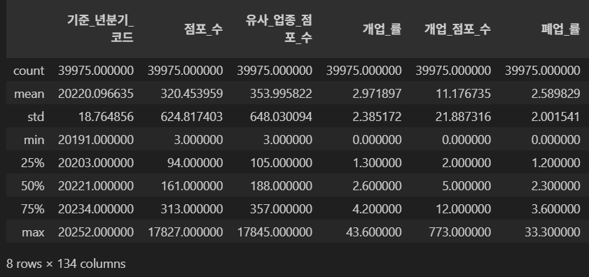

## 모델 성능 개선

**1. 회귀 모델 학습 및 성능 저하**

- 초기 접근: 폐업률을 예측하기 위해 회귀 모델을 적용
- 결과: 모든 모델의 성능이 낮게 나타남 (r² < 0.5)

**2. 원인 파악: 데이터 분포 불균형**

- **폐업률 분포 분석 결과**
    - 대부분의 값이 0~5% 구간에 집중, 일부 지역은 10% 이상의 극단값 존재

        
        
    - 평균(2.59%) < 최대값(33.3%) → 극단적인 우측 꼬리(long-tail) 분포
        

        
        
- **문제점**
    - 폐업률 데이터가 심한 왜도(skewness, 치우침)를 가지며 **비선형적 관계**를 형성
    - 결과적으로 **회귀선이 왜곡**되고 **일반화 성능 저하**

**3. 이상치 제거 시도**
- 폐업률 10% 이상 데이터 제거 후 재학습
- 결과: 분포의 꼬리가 다소 완화되었으나, 여전히 0~5% 구간에 밀집 → **비대칭성 유지**
- 결론: 단순 이상치 제거로는 성능 개선 한계 확인

**4. 분류 모델로 전환**
- 정책적/실무적으로도 “폐업률이 높은 지역인가?”가 핵심이지, “정확히 2.58%인지”는 중요하지 않으므로 분류 모델로 전환
- 폐업률 상위 25%(3.6% 이상)를 ‘위험’, 나머지를 ‘안정’으로 정의
- 이진분류 모델 적용
- 결과: 분류 모델의 Accuracy·F1-score 모두 유의미하게 향상

**5. 성능 향상 원인**

- **데이터 불균형 완화**: 미세한 수치 예측 대신, 위험 여부 구분에 집중
- **노이즈의 영향 감소**
    - 회귀에서는 2.1% vs 2.3%도 오차로 처리되지만, 분류에서는 둘 다 ‘안정’으로 묶여서 불필요한 오차 제거
    - 결과적으로 **모델의 안정성과 일반화 성능 향상**

## 시계열 모델 부적합